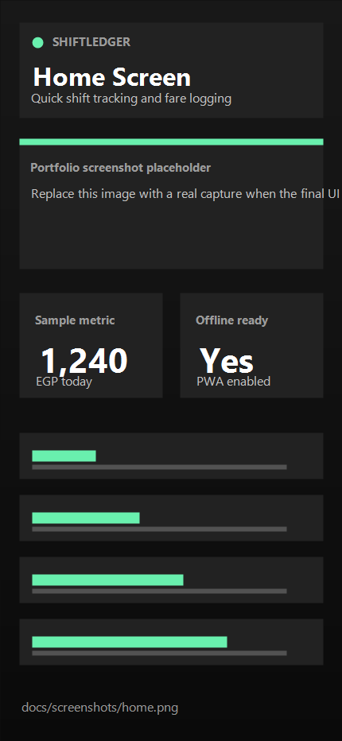
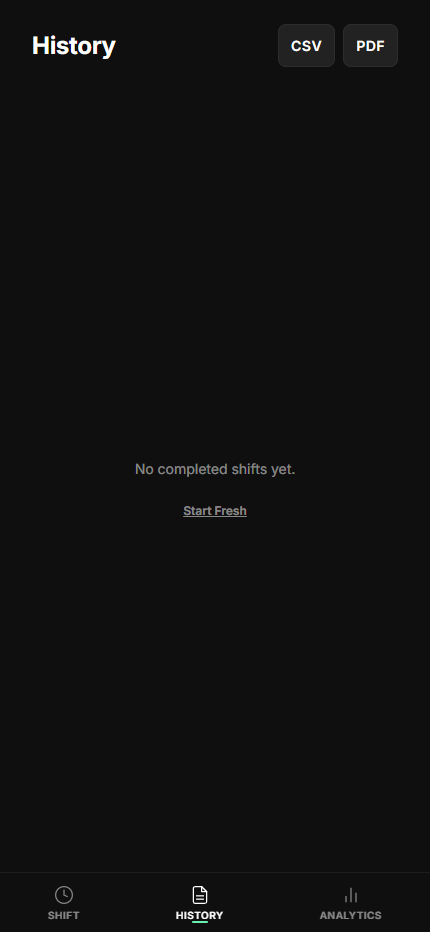
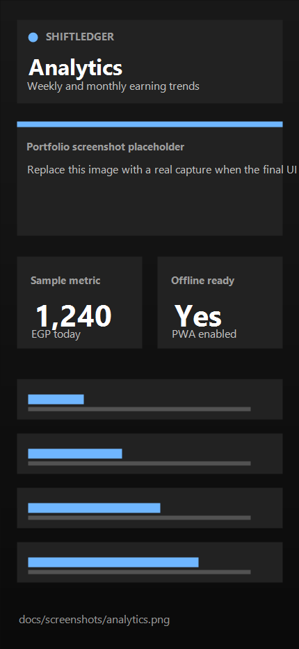

# ShiftLedger

ShiftLedger is an offline-first income tracker built for drivers and gig workers who need a fast way to log fares, expenses, and completed shifts from a phone-friendly interface.

## Description

Many ride-hailing and delivery workers track earnings manually across notes, chats, or spreadsheets. ShiftLedger brings that workflow into a lightweight Progressive Web App that helps drivers monitor daily net income, review past shifts, and spot trends over time without relying on a backend service.

This project is especially useful for:

- Drivers who want a quick shift-by-shift income view
- Gig workers managing fuel and operating costs
- Anyone who needs a simple offline-first personal earnings dashboard

## Key Features

- Shift tracking with a live timer and running earnings display
- Income and expense logging optimized for rapid entry
- Analytics dashboard with weekly and monthly Chart.js visualizations
- Offline support through a service worker and web app manifest
- Undo system for reversing accidental deletions or shift-ending actions
- CSV and print-friendly PDF export options

## Screenshots

### Home Screen



### History



### Analytics



## Live Demo

🔗 Live Demo: coming soon

## Tech Stack

- HTML5
- CSS3
- Vanilla JavaScript
- LocalStorage
- Chart.js
- Service Worker and Web App Manifest (PWA)

## Project Structure

```text
.
|-- assets/
|   `-- icon.png
|-- css/
|   `-- app.css
|-- docs/
|   `-- screenshots/
|       |-- analytics.png
|       |-- history.png
|       `-- home.png
|-- js/
|   `-- app.js
|-- src/
|   `-- .gitkeep
|-- index.html
|-- manifest.json
|-- README.md
`-- service-worker.js
```

`src/` is included to support future modular expansion without changing the public app entry points.

## How To Run Locally

1. Clone the repository.
2. Open a terminal in the project root.
3. Start a simple local server:

```bash
python -m http.server 8000
```

4. Open `http://localhost:8000` in your browser.
5. For PWA behavior and service worker caching, test the app through the local server rather than opening `index.html` directly.

## Future Improvements

- Edit existing income and expense entries
- Add optional cloud sync and backup
- Track distance and cost per kilometer
- Add richer filters for history and analytics

